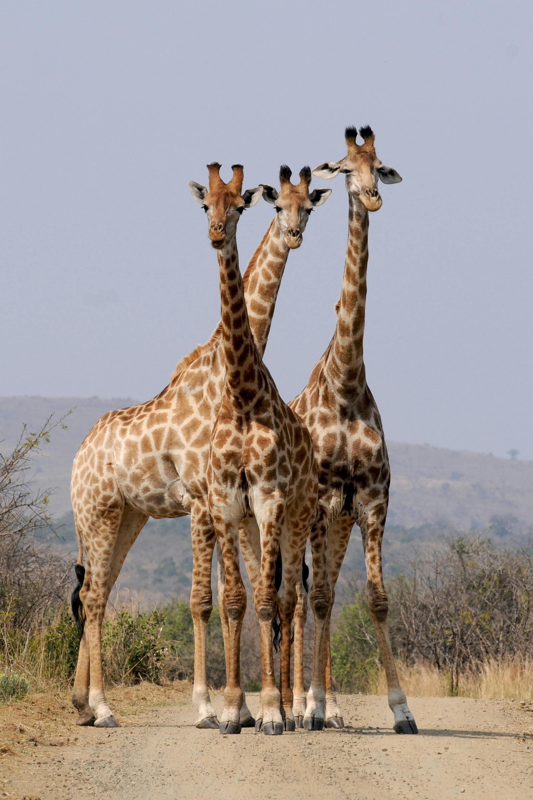

# 

 GIRAFFE 
 

**Note:** The giraffe, the tallest living terrestrial animal, is native to the savannas and woodlands of Africa, where its height allows it to feed on leaves and buds in treetops, beyond the reach of other herbivores. This remarkable height is attributed to its long neck and legs, and yet, the giraffe's neck contains the same number of vertebrae as most other mammals. Giraffes are known for their distinctive coat patterns, with each individual boasting a unique set of spots that serve as camouflage to protect against predators. These gentle giants lead a primarily social lifestyle, forming loose herds that roam the open landscapes. Despite their size, giraffes are surprisingly agile and can sprint up to 35 miles per hour over short distances and trot steadily at 10 miles per hour. Giraffes play a crucial role in their ecosystems by acting as pollinators and seed dispersers, contributing to the health and diversity of their habitats.

---

---
**Tip:**
| Name      | Sort |
| ----------- | ----------- |
| Giraffe     | Animal |

---
[Go to home page](README.md)